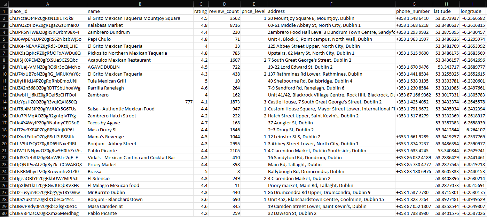
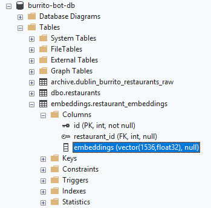
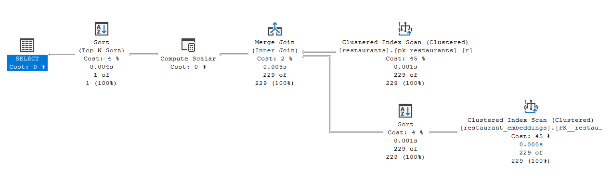
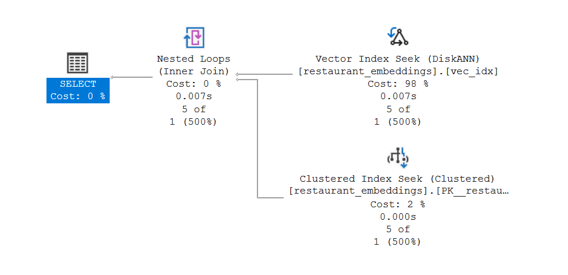

# AI-Powered Search

---

## Andrew Pruski

### Principal Field Solutions Architect
#### Microsoft Data Platform MVP 
#### Docker Captain

<!-- .slide: style="text-align: left;"> -->
<i class="fa-brands fa-bluesky"></i><a href="https://bsky.app/profile/dbafromthecold.com">  @dbafromthecold.com</a> 
<i class="fas fa-envelope"></i>  dbafromthecold@gmail.com 
<i class="fab fa-wordpress"></i>  www.dbafromthecold.com 
<i class="fab fa-github"></i><a href="https://github.com/dbafromthecold">  github.com/dbafromthecold</a>

---

## Session Aim
<!-- .slide: style="text-align: left;"> -->
To dive into how AI-Powered Search works 
in SQL Server 2025
 
 
Starting from the ground up, we'll build an AI-Powered Search tool

---

## Semantic Similarity Searching
<!-- .slide: style="text-align: left;"> -->
Semantic similarity search finds results with similar meaning, even when the exact words differ, by comparing vector embeddings generated from data.

---

---

## What are the steps?
<!-- .slide: style="text-align: left;"> -->
<ul>
<li class="fragment">Get raw data</li>
<li class="fragment">Chunk that data</li>
<li class="fragment">Generate embeddings</li>
<li class="fragment">Perform exact search</li>
<li class="fragment">Create vector index</li>
<li class="fragment">Perform approximate search</li>
<li class="fragment">Create stored procedure to be used by web interface</li>
</ul>

---

## Starting off with the data
<!-- .slide: style="text-align: left;"> -->
<pre><code data-line-numbers="6|22-26|23">USE [burrito-bot-db];
GO

DECLARE @ApiKey    VARCHAR(100)  = 'XXXXXXXXXXXXXXXXXXXXXXXXXXXXXXXXXXX';
DECLARE @Keyword   VARCHAR(10)   = 'mexican';
DECLARE @BaseUrl   VARCHAR(100)  = 'https://maps.googleapis.com/maps/api/place/nearbysearch/json';
DECLARE @Radius    VARCHAR(10)   = '20000';
DECLARE @Latitude  VARCHAR(10)   = '53.3498';
DECLARE @Longitude VARCHAR(10)   = '-6.2603';

DECLARE @FullUrl VARCHAR(500);

SET @FullUrl = @BaseUrl + '?location=' 
         + @Latitude + ',' 
         + @Longitude +
         + '&radius=' + @Radius +
         + '&type=restaurant' +
         + '&keyword=' + @Keyword
         + '&key=' + @ApiKey
         PRINT @FullUrl

DECLARE @ret1 INT, @response1 NVARCHAR(MAX)
EXEC @ret1 = sp_invoke_external_rest_endpoint
    @url = @FullUrl,
    @response = @response1 OUTPUT;
PRINT @response1
</pre></code>

---

## Raw Data
<!-- .slide: style="text-align: left;"> -->

---

## Chunking data
<!-- .slide: style="text-align: left;"> -->
- What data are we going to create embeddings from?
- What level of granularity are we going to use?
- Where are we going to store those embeddings?
- How are we going to query those embeddings?

---

## Issues with chunking
<!-- .slide: style="text-align: left;"> -->
- Vector Database Limitations
  - Single vector across large embeddings - becomes vague
- Loss of context
  - Splitting out into chunks can result in loss of context
- Computational complexity
  - More chunks, more embeddings, more maintenance

---

## Database design
<!-- .slide: style="text-align: left;"> -->
<pre><code data-line-numbers="1|3|4-5|6-7|8-9|10-11|12-13">CREATE DATABASE [burrito-bot-db]
 ON  PRIMARY 
( NAME = N'burrito-bot-db', FILENAME = N'F:\SQLData1\burrito-bot-db.mdf' ), 
 FILEGROUP [ARCHIVE] 
( NAME = N'burrito-bot-db-archive', FILENAME = N'F:\SQLData1\burrito-bot-db-archive.ndf' ), 
 FILEGROUP [DATA] 
( NAME = N'burrito-bot-db-data', FILENAME = N'F:\SQLData1\burrito-bot-db-data.ndf' ,
 FILEGROUP [EMBEDDINGS] 
( NAME = N'burrito-bot-db-embeddings', FILENAME = N'F:\SQLData1\burrito-bot-db-embeddings.ndf' ), 
 FILEGROUP [RAW_DATA] 
( NAME = N'burrito-bot-db-raw-data', FILENAME = N'F:\SQLData1\burrito-bot-db-raw-data.ndf' )
 LOG ON 
( NAME = N'burrito-bot-db_log', FILENAME = N'G:\SQLTLog1\burrito-bot-db_log.ldf' )
</pre></code>

---

## Generating Embeddings
<!-- .slide: style="text-align: left;"> -->
<pre><code data-line-numbers="1">AI_GENERATE_EMBEDDINGS(@search_text USE MODEL [text-embedding-3-small])
</pre></code>
 
- References an external model 
- sp_invoke_external_endpoint enabled 
- Where is that model located?

---

## The Vector Data Type
<!-- .slide: style="text-align: left;"> -->

 
 
- Dictated by external model 
- Maximum number is 1998 
- Float32 & Float16 supported 

---

## Distance metrics
<!-- .slide: style="text-align: left;"> -->

<ul>
  <li class="fragment fade-in-then-semi-out">
    Euclidean &rarr; How far apart are these rows?
  </li>
  <li class="fragment fade-in-then-semi-out">
    Dot Product &rarr; How aligned are they?
  </li>
  <li class="fragment fade-in-then-semi-out">
    Cosine &rarr; How similar is their meaning?
  </li>
</ul>

---

## Euclidean Distance
<!-- .slide: style="text-align: left;"> -->

$$ d(\mathbf{a}, \mathbf{b}) =
  \sqrt{(a_1 - b_1)^2 + (a_2 - b_2)^2 + \dots + (a_n - b_n)^2} $$

- Measures the straight-line distance
- Considers differences across all dimensions
- Smaller distance = vectors are numerically closer

---

## Dot Product
<!-- .slide: style="text-align: left;"> -->

$$
\mathbf{a} \cdot \mathbf{b}
=
\sum_{i=1}^{n} a_i b_i
=
a_1 b_1 + a_2 b_2 + a_3 b_3 + \dots + a_n b_n
$$

- Measures how strongly two vectors align
- Influenced by both direction and magnitude
- Larger value = stronger match
- Forms the basis of cosine similarity

---

## Cosine Similarity
<!-- .slide: style="text-align: left;"> -->

$$
\mathrm{sim}(\mathbf{a}, \mathbf{b})
=
\frac{\mathbf{a} \cdot \mathbf{b}}
     {\Vert \mathbf{a} \Vert \, \Vert \mathbf{b} \Vert}
$$

- Measures the angle between vectors, not their size
- Focuses purely on direction (meaning)
- Mathematical range: -1 to 1
- Semantic search values are typically between 0 and 1

---

## Why Cosine Works for Burrito Bot
<!-- .slide: style="text-align: left;"> -->

- A longer restaurant description should not automatically rank higher
- We want restaurants that mean the same thing, not just contain more words
- Cosine normalizes vector length and compares semantic direction

---

## Exact Search
<!-- .slide: style="text-align: left;"> -->
<ul>
  <li>K-nearest neighbour search (k-NN)</li>
  <li>Calculates distance between the search vector and every other row</li>
  <li>Selects the closest neighbours based on a specific distance metric</li>
  <li>Computationally expensive</li>
  <li class="fragment fade-in">Table scans!</li>
</ul>

---

## Vector Distance
<!-- .slide: style="text-align: left;"> -->
<pre><code data-line-numbers="1-2|2|4-15|13|16">DECLARE @search_text NVARCHAR(MAX) = 'Find me a restaurant with a 5 star rating';
DECLARE @search_vector VECTOR(1536) = AI_GENERATE_EMBEDDINGS(@search_text USE MODEL [text-embedding-3-small]);

SELECT TOP(1)
	r.[id], 
	r.[name], 
	r.[city], 
	r.[rating], 
	r.[review_count], 
	r.[address], 
	r.[phone], 
	r.[url],
	vector_distance('cosine', @search_vector, e.embeddings) AS distance
FROM [dbo].[restaurants] r
INNER JOIN [embeddings].[restaurant_embeddings] e ON r.id = e.restaurant_id
ORDER BY distance;
GO
</pre></code>

---

## Vector Distance
<!-- .slide: style="text-align: left;"> -->

---

## Approximate Search
<!-- .slide: style="text-align: left;"> -->
- Exact k-NN search does not scale for large vector datasets
- Approximate Nearest Neighbor (ANN) improves speed dramatically
- Trades a small amount of accuracy for major performance gains
- Accuracy measured by recall (how close results are to exact search)
- ANN requires a vector index
- SQL vector indexes are based on DiskANN

---

## DiskANN
<!-- .slide: style="text-align: left;"> -->
- Graph-based index connecting similar vectors
- Finds neighbors by traversing graph paths instead of scanning all data
- Built for large-scale vector datasets
- Uses SSD + minimal memory efficiently
- Provides:
  - High queries-per-second (QPS)
  - Low latency
  - Balanced CPU, memory, and I/O usage

---

## Vector Indexes
<!-- .slide: style="text-align: left;"> -->
<pre><code data-line-numbers="1-6|3|4|5">CREATE VECTOR INDEX vec_idx ON [embeddings].[restaurant_embeddings]([embeddings])
WITH (
    metric = 'cosine',
    type = 'diskann',
    maxdop = 8
);</pre></code>

---

## Things to be aware of!
<!-- .slide: style="text-align: left;"> -->

<ul>
  <li>Requires preview features to be enabled</li>
  <li>Vector indexes set a table to read only/li>
  <li>Requires a single column, integer, clustered primary key</li>
  <li>No replication to subscribers</li>
  <li class="fragment fade-in">MAXDOP is ignored (currently, see SQL 2025 known issues)</li>
</ul>

---

## Vector Search
<!-- .slide: style="text-align: left;"> -->
<pre><code data-line-numbers="1-13|1-2|4-13|7|8|9|10|11|12">DECLARE @search_text NVARCHAR(MAX) = 'Find me a restaurant with a 5 star rating';
DECLARE @search_vector VECTOR(1536) = AI_GENERATE_EMBEDDINGS(@search_text USE MODEL [text-embedding-3-small]);

SELECT
    restaurant_id,
    distance
FROM vector_search(
    TABLE      = [embeddings].[restaurant_embeddings],
    COLUMN     = [embeddings],
    SIMILAR_TO = @search_vector,
    METRIC     = 'cosine',
    TOP_N      = 5
)
</pre></code>

---

## Vector Search
<!-- .slide: style="text-align: left;"> -->

---

## Resources
<!-- .slide: style="text-align: left;"> -->

<a href="https://github.com/dbafromthecold/aipoweredsearch">https://github.com/dbafromthecold/aipoweredsearch</a> 

